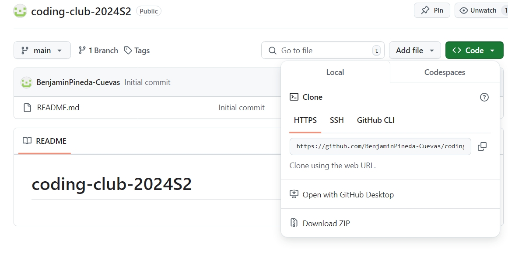
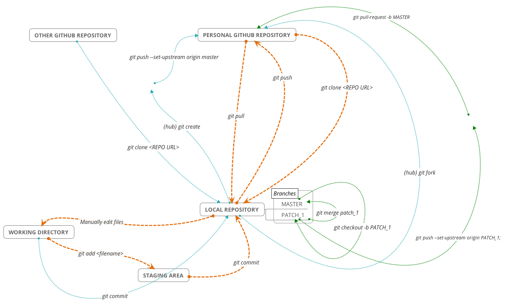
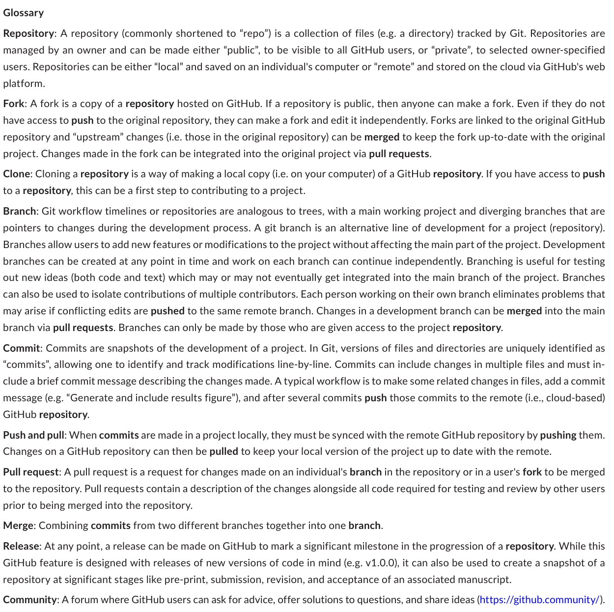

# INTRODUCCCIÓN

## **¿Qué es GitHuB?**
Es un servicio cloud-based para documentar y mantener un control de versiones. Está diseñado específicamente para almacenar, rastrear cambios y permitir la colaboración en código informático, lo que resulta fundamental en la investigación moderna. **Permite a los usuarios participar en proyectos contribuyendo, modificando y discutiendo el código existente, informando de errores, descubriendo código y datos, y publicando códigos nuevos**. Los archivos y directorios son cargados en **repositorio**, manteniendo un orden cronológico de modificaciones. Puede usarse para almacenar los archivos asociados a cierto proyecto o trabajo en un laboratorio.
Git corresponde al sistema de control de versiones que habilita las herramientas colaborativas disponibles en GitHub.
Cada proyecto creado en Rstudio corresponde a un solo repositorio en GitHub

# USO DE GITHUB CON RSTUDIO

## **Protocolo de instalación y sincronización del repositorio**

0. Crear carpeta R en disco C:

1. Crearse una cuenta en GitHub

2. Descargar e instalar Git. Git es un software de control de versiones diseñado, pensando en la eficiencia, la confiabilidad y compatibilidad del mantenimiento de versiones de aplicaciones cuando estas tienen un **gran número de archivos de código fuente**. [Descargar aquí](https://git-scm.com/downloads)

3. Descargar e instalar librerias en R
```{r eval=FALSE}
library(gitcreds)
library(askpass)
library(commonmark)
library(credentials)
library(gert)
library(gh)
library(remotes)
```

4. Configurar Git: los cambios hechos en GitHub se asocian a un usuario

git_config_global_set("user.name", "Your Name")

git_config_global_set("user.email", "your@email.com")

git_config_global()

5. Configurar Rstudio

  5.1 Abrir RStudio
  
  5.2 Haga clic en Herramientas -> Opciones globales -> Git/SVN --> marcar primer cuadro 
  
6. Sincronizar el repositorio desde repo preexistente 
  Descargar el repositorio: copia el link del repositorio y en RStudio, hacer clic en File/ New Project/ Version control/ Git y pegue el enlace que copió de Github. Seleccionar la carpeta R (C:/R). Aquí se creará la copia local del repositorio
  
  
  

## **Subir y bajar archivos**

En proyectos colaborativos resulta relevante mantener una base de datos de fácil acceso donde puedan acceder los integrantes del equipo. GitHub permite generar un repositorio digital donde almacenar datos crudos, datos procesados, scripts para algún análisis particular, entre otros archivos. GitHub permite otorgar accesos para ver o editar la información disponible, permitiendo compartir datos con integrantes del equipo y con la comunidad de GitHub. Es posible sincronizar GitHub con Rstudio para acceder y manipular la base de datos desde el local de cada usuario. De esta forma, es posible bajar los archivos necesarios, trabajar con ellos desde el local y subirlos nuevamente a GitHub según las necesidades de cada proyecto. 




1. Cargar librerias
```{r eval=FALSE}
library(gitcreds)
library(askpass)
library(commonmark)
library(credentials)
library(gert)
library(gh)
library(remotes)
```
2. Seleccionar el archivo de .md que el corresponda

3. Escribe lo que quieras

4. Guarda los cambios. Hasta este punto los cambios en el archivo están almacenados en tu disco local.

5. Para verificar el estado de los archivos respecto a la nube. Podría por ejemplo indicar que se realizó en ciertos archivos localizados en la nube

  git_status()
  
6. Seleccionar los archivos a subir a la nube

  git_add("") Ej: git_add("Prueba")
  
  git_status
  
7. Registrar los cambios realizados. **Commit** se refiere a un mensaje muy corto en que se especifica los cambios que se hizo desde la última actualización. Este mensaje aparecerá en la versión online también. A este punto se tendrá seleccionado y listos para subirse los archivos al repositorio. git_commit("") 

Ej: git_add("actualización final")

  git_status
  
8. "Empujar" los cambios seleccionados al repositorio


  git_push()
  
9. En proyectos colaborativos git_pull() sirve para "jalar" los cambios realizados por otros usuarios o cambios realizados directamente en GitHub.com que no estén sincronizados con la copia local

# RECOMENDACIONES DE USO DE GITHUB

## **flujo de trabajo típico en GitHub**

1. Crear un repositorio remoto que se sincronice con archivos y directorios almacenados localmente

2. Modificar estos archivos, ya sea local o a distancia

3. "commit" (o registrar) con frecuencia cambios en estos archivos junto con una descripción de las modificaciones

4. Sincronizar confirmaciones con GitHub para que el repositorio en la web y los repositorios locales estén actualizados.

## **Usos prácticos de GitHub**

- **Almacenar y compartir material de investigación:** Incluye todos los materiales computacionales relacionados con la producción de investigación, incluidos los datos, el código para análisis y los protocolos. Usar GitHub permite almacenar los datos en un servidor remoto centralizado y fácilmente disponible. Los cambios realizados en los archivos en repositorios con control de versiones van acompañados de descripciones de las modificaciones, de forma que **la historia completa de mensajes de commits pueden ser vistos y usarse de forma similar a un cuaderno físico de laboratorio**. Esto proporciona una alternativa segura y menos desordenada a hacer con frecuencia copias completas de documentos en diferentes puntos de su evolución (por ejemplo, análisis. R, analysis_v2. R, analysis_FINAL. R).

- **Continuidad en los proyectos:** GitHub puede facilitar la continuidad del proyecto en la investigación al facilitar la transferencia de código y datos entre usuarios. A través del control de versiones, el historial del código y los datos de los proyectos de ecología y evolución se vuelve accesible para los futuros miembros y colaboradores del laboratorio. Útil para realizar análisis con data a largo plazo

- **Gestión de proyectos:** Issues (Por ejemplo discusión de problemas), discusion y projects (seguimiento de las prioridades y el estado del proyecto). Facilita mantener el registro del prorgeso a traves de la duración del proyecto. 

- **Generar material educativo***

- **Crear un sitio web:** Los sitios web personales o de laboratorio pueden mejorar el intercambio de los resultados de la investigación, crear presencia en línea y aumentar la coordinación de los esfuerzos de investigación

- **Archivar datos y códigos para citas:** la deposición de datos y la garantía de su disponibilidad pueden amplificar el alcance de los estudios publicados, aumentar las tasas de citación y, entre muchas otras razones, permitir la reproducibilidad y la rentabilidad de los avances científicos

- **Edición de código colaborativa y asincrónica:** GitHub tiene algunas características que permiten a los colaboradores discutir y trabajar simultáneamente en un proyecto.Por ejemplo, **los usuarios pueden clonar y bifurcar repositorios, lo que permite realizar modificaciones en una copia vinculada de un repositorio, que luego se puede fusionar en el proyecto principal a través de pull request**. Los colaboradores pueden comentar líneas específicas de código y texto o sugerir cambios, que luego se pueden incorporar con solo hacer clic en un botón, lo que facilita en gran medida la revisión por pares.

- **Escribir un manuscrito**

- **Revisión por pares**

- **Discusiones de open Science**

- **Automatización:** La automatización puede ayudar a avanzar más rápidamente, compartiendo datos ecológicos y asegurándose de que los datos sean de alta calidad. La integración de flujos de trabajo de automatización se ha fomentado mucho en áreas de las ciencias ecológicas y evolutivas, incluida la ecología predictiva, los estudios ecológicos a largo plazo, e información sobre la gestión de especies en riesgo.

- **Organizar y manejar equipos:** Los colaboradores se pueden agrupar en equipos dentro de una organización, lo que permite a los administradores asignar roles, tareas y permisos de modificación de repositorios a los miembros de la organización

## **Objetivo del repositorio GET**
Almacenar la información pasada, presente y futura correspondiente al GET. Incluye datos climáticos por temporada y sitios de muestreo, scripts de análisis, figuras relevantes, manuscritos y/o archivos para publicaciónes y carpetas individuales con el trabajo de cada integrante del equipo
En un futuro se pretende hacer publicas ciertas bases de datos con información relevante para la comunidad científica

# GLOSARIO



# **Referencias**
- https://jennybc.github.io/2014-05-12-ubc/ubc-r/session03_git.html
- Braga, P. H. P., Hébert, K., Hudgins, E. J., Scott, E. R., Edwards, B. P. M., Sánchez Reyes, L. L., Grainger, M. J., Foroughirad, V., Hillemann, F., Binley, A. D., Brookson, C. B., Gaynor, K. M., Shafiei Sabet, S., Güncan, A., Weierbach, H., Gomes, D. G. E., & Crystal-Ornelas, R. (2023). Not just for programmers: How GitHub can accelerate collaborative and reproducible research in ecology and evolution. Methods in Ecology and Evolution, 14, 1364–1380. https://doi.org/10.1111/2041-210X.14108
